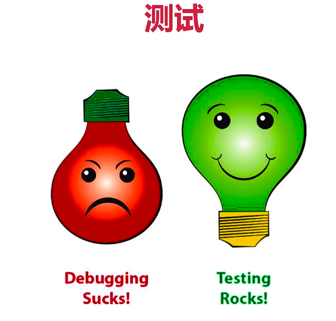
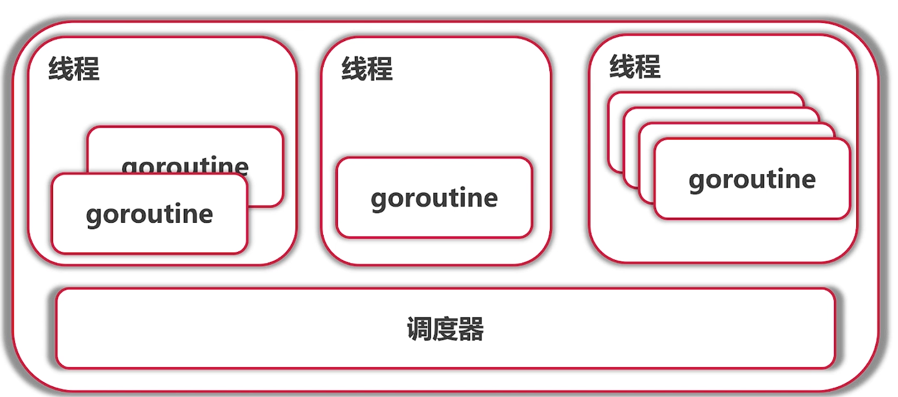

# Go开发工程师
## 基础知识
***
### 内建容器
#### array (数组)


知识点:
> * 数组是值类型  
> * [10]int 和 [20]int是不同类型
> * 调用func f(arr [10]int)会拷贝数组
> * 在go语言中一般不直接使用数组,而是用<u>**切片**</u>
> * 参数传递是<u>**值传递**</u>

案例:
``` go
// 数组的定义 
// 遍历数组
// 获取下标和值
func main() {
	//数组的多种定义方法
	var arr1 [5]int
	arr2 := [3]int{1, 2, 3}
	arr3 := [...]int{1, 2, 3, 4, 5}

	//二维数组
	var grid [4][5]int

	fmt.Println(arr1, arr2, arr3)
	fmt.Println(grid)

	//遍历数组
	/*
		for i := 0; i < len(arr3); i++ {
			fmt.Println(arr3[i])
		}
	*/
	//遍历数组 range 关键字可以获取数组的下标
	for i := range arr3 {
		fmt.Println(arr3[i])
	}

	//获取下标和值
	for i, v := range arr3 {
		fmt.Println(i, v)
	}

	// 只要值, 不需要下标
	for _, v := range arr3 {
		fmt.Println(v)
	}

	fmt.Println("printArray(arr1")
	printArray(arr1)

	fmt.Println("printArray(arr3")
	printArray(arr3)

	fmt.Println("arr1 and arr3")
	fmt.Println(arr1, arr3)
}
```

#### Slice(切片)
* Slice(切片)是数组的视图
##### Slice的扩展  


##### Slice的 <u>添加元素</u> 操作

> * 向Slice添加元素,添加元素时如果超越cap，系统会重新分配更大的底层数组
> * 由于值传递的关系，必须接收append的返回值

案例:

```go
package main
import "fmt"

func updateSlice(s []int) {
	s[0] = 100
}

func main() {
	arr := [...]int{0, 1, 2, 3, 4, 5, 6, 7}
	fmt.Println("arr[2:6] = ", arr[2:6])
	fmt.Println("arr[:6] = ", arr[:6])
	s1 := arr[2:]
	fmt.Println("s1 = ", s1)
	s2 := arr[:]
	fmt.Println("s2 = ", s2)

	fmt.Println("After updateSlice(s1)")
	updateSlice(s1)
	fmt.Println(s1)
	fmt.Println(arr)

	fmt.Println("After updateSlice(s1)")
	updateSlice(s2)
	fmt.Println(s2)
	fmt.Println(arr)

	fmt.Println("Reslice")
	fmt.Println(s2)
	s2 = s2[:5]
	fmt.Println(s2)
	s2 = s2[2:]
	fmt.Println(s2)

	// slice的扩展
	fmt.Println("now arr: ", arr)
	fmt.Println("Extending slice")
	arr[0], arr[2] = 0, 2
	fmt.Println("now arr: ", arr)
	s1 = arr[2:6]
	s2 = s1[3:5] // [s1[3], s1[4]]
	//fmt.Println("s1: ", s1) //s1:  [2 3 4 5]
	fmt.Printf("s1=%v, len(s1)=%d, cap(s1)=%d\n",
		s1, len(s1), cap(s1))
	fmt.Printf("s2=%v, len(s2)=%d, cap(s2)=%d\n",
		s2, len(s2), cap(s2))
	//fmt.Println("s2: ", s2) //s2:  [5 6]

	//slice的添加(append)
	//s = append(s, val)
	s3 := append(s2, 10)
	s4 := append(s3, 11)
	s5 := append(s4, 12)
	fmt.Println("s3, s4, s5 = ", s3, s4, s5)
	// s4 and s5 no longer view arr
	fmt.Println("arr = ", arr)

}
```
##### Slice<u>**其它操作**</u>
> * 创建slice
> * 拷贝
> * 删除
> * 去掉开头值 和 结束值

案例:
```go
package main

import "fmt"

func printSlice(s []int) {
	fmt.Printf("%v len=%d cap=%d\n", s, len(s), cap(s))
}

func main() {
	//创建slice
	fmt.Println("Creating slice")
	var s []int // Zero value for slice is nil

	for i := 0; i < 100; i++ {
		printSlice(s)
		s = append(s, 2*i+1)
	}
	fmt.Println(s)

	s1 := []int{2, 4, 6, 8}
	printSlice(s1)

	s2 := make([]int, 16)
	s3 := make([]int, 10, 32)
	printSlice(s2)
	printSlice(s3)
    
	//拷贝操作
	fmt.Println("Copying slice")
	copy(s2, s1)
	printSlice(s2)

	//删除操作(用append函数,"..."三个点表示后面所有的值)
	fmt.Println("Deleting elements from slice")
	s2 = append(s2[:3], s2[4:]...)
	printSlice(s2)

	//去掉开头值
	fmt.Println("Popping from front")
	front := s2[0]
	s2 = s2[1:]
	fmt.Println(front)
	printSlice(s2)

	//去掉结束值
	fmt.Println("Popping from back")
	tail := s2[len(s2)-1]
	s2 = s2[:len(s2)-1]

	fmt.Println(tail)
	printSlice(s2)
}
```
#### Map
##### Map结构定义
> * map[k]v
> * map[k1]map[k2]v

##### Map的操作  
> * 创建:make(map[string]int)  
> * 获取元素: m[key]  
> * key不存在时,获得Value类型的初始值  
> * 用value, ok := m[key] 来判断是否存在key
> * 用delete函数删除一个key

##### Map的遍历
> * 使用range遍历key, 或者遍历key,value对
> * 不保证遍历顺序,如需顺序,需手动对key排序
> * 使用len获得元素的个数

##### Map的key
> * map使用哈希表，必须可以比较相等
> * 除了slice, map,function的内建类型都可以作为key
> * Struct类型不包含上述字段，也可作为key

案例:
```go
func main() {
	//构造
	fmt.Println("--------Creating map--------")
	m := map[string]string{
		"name":    "ccmouse",
		"course":  "golong",
		"site":    "imooc",
		"quality": "notbad",
	}

	//make定义法:使用 make 创建的 map 是已初始化的，可以直接使用。
	m2 := make(map[string]int) //m2 == empty map

	//var定义法:使用 var 声明的 map 是 nil，未初始化，可以读取 nil map 中的值，返回该类型的零值,但不能直接用于存储键值对，必须用 make 初始化后才能使用。
	var m3 map[string]int // m3 == nil

	fmt.Printf("m1 = %v\nm2 = %v\nm3 = %v\n", m, m2, m3)

	//遍历
	//map中的k,v对是无序的,需要手动使用slice对map的key进行排序
	fmt.Println("--------Traversing map--------")
	for k, v := range m {
		fmt.Println(k, v)
	}

	//取值
	fmt.Println("--------Getting values--------")
	courseName, ok := m["course"]
	fmt.Println(courseName, ok)
	//判断map的值存不存在
	//对于 nil 的 map，读取一个不存在的键不会产生错误，只会返回该值类型的零值
	//ok 是一个布尔值，用于表示在 map 中是否存在指定的键
	if courName, ok := m["crse"]; ok {
		fmt.Println(courName)
	} else {
		fmt.Println("key does not exist")
	}

	//删除
	fmt.Println("--------Deleting map--------")
	name, ok := m["name"]
	fmt.Println(name, ok)

	delete(m, "name")
	name, ok = m["name"]
	fmt.Println(name, ok)
}
```

例子:
寻找最长不含有重复字符的子串  

* abcabcbb → abc
* bbbb → b
* pwwkew → wke

对于每一个字母X

* lastOccurred[x]不存在，或者<start   →无需操作
* lastOccurred[x] >= star  →更新start
* 更新lastOccurred[x]，更新maxLength

```go
package main

import "fmt"

// 1. 函数定义
func lengthOfNonRepeatingSubStr(s string) int {
	// 2. 变量初始化
	lastOccurred := make(map[byte]int)
	start := 0
	maxLength := 0

	// 3. 遍历字符串
	//将字符串 s 转换为 byte 切片后遍历，每个字符以 ch 表示，其索引为 i。
	//之所以将 s 转换为 byte 切片，是因为代码仅处理 ASCII 字符。
	//如果想支持 Unicode 字符，可以将 byte 换成 rune
	for i, ch := range []byte(s) {
		//4. 判断是否出现重复字符
		if lastI, ok := lastOccurred[ch]; ok && lastI >= start {
			start = lastI + 1
		}
		// 5. 更新最长子串长度
		//i - start + 1 表示 start 到 i 之间的字符数
		//这就是从 start 到 i 之间的字符总数。
		if i-start+1 > maxLength {
			maxLength = i - start + 1
		}
		// 6. 更新字符最近出现的位置
		lastOccurred[ch] = i
	}
	// 7. 返回结果
	return maxLength
}
func main() {
	fmt.Println(lengthOfNonRepeatingSubStr("abcabcbb"))
	fmt.Println(lengthOfNonRepeatingSubStr("bbbbbb"))
	fmt.Println(lengthOfNonRepeatingSubStr("pwwkew"))
	fmt.Println(lengthOfNonRepeatingSubStr(""))
	fmt.Println(lengthOfNonRepeatingSubStr("b"))
	fmt.Println(lengthOfNonRepeatingSubStr("abcdef"))
	fmt.Println(lengthOfNonRepeatingSubStr("让我们说中文"))
	fmt.Println(lengthOfNonRepeatingSubStr("一二三三二一"))
}
```

解题思路:

> ### 1. 题目思路：不重复子串的长度
>
> 题目要求找到**最长的不重复子串**的长度，也就是说，你需要遍历字符串中的每个字符，记录从当前位置开始到结束的、不包含重复字符的最长子串。每当发现字符重复，就从重复字符之后开始新的子串。
>
> ### 2. 解题的具体步骤
>
> 假设你有字符串 `"abcabcbb"`，按照步骤来看看如何处理：
>
> 1. **定义需要的变量**：
>    - `lastOccurred`：记录每个字符上次出现的位置。
>    - `start`：当前子串的起点。
>    - `maxLength`：记录最大子串的长度。
> 2. **遍历字符串**：
>    - 遍历每个字符的索引 `i` 和字符本身 `ch`。
>
> ### 3. 逐步分析每个字符的操作
>
> 我们逐字符地分析 `"abcabcbb"`，假设 `start` 一开始是 `0`，`maxLength` 是 `0`。
>
> #### Step 1：遍历字符 `'a'`（索引 `0`）
>
> - `lastOccurred` 没有 `'a'`，说明当前子串没有重复字符。
> - 更新 `maxLength` 为 `1`。
> - 将 `'a'` 的索引 `0` 存入 `lastOccurred`：`{'a': 0}`。
>
> #### Step 2：遍历字符 `'b'`（索引 `1`）
>
> - `lastOccurred` 没有 `'b'`，继续扩展子串。
> - 更新 `maxLength` 为 `2`。
> - 将 `'b'` 的索引 `1` 存入 `lastOccurred`：`{'a': 0, 'b': 1}`。
>
> #### Step 3：遍历字符 `'c'`（索引 `2`）
>
> - `lastOccurred` 没有 `'c'`，继续扩展子串。
> - 更新 `maxLength` 为 `3`。
> - 将 `'c'` 的索引 `2` 存入 `lastOccurred`：`{'a': 0, 'b': 1, 'c': 2}`。
>
> #### Step 4：遍历字符 `'a'`（索引 `3`）
>
> - `lastOccurred` 有 `'a'`，且上次出现的位置是 `0`，这意味着我们遇到重复字符。
> - 将 `start` 更新到 `lastOccurred['a'] + 1 = 1`，以跳过之前的重复字符。
> - 更新 `'a'` 的索引为 `3`，现在 `lastOccurred = {'a': 3, 'b': 1, 'c': 2}`。
>
> #### Step 5：继续遍历其他字符
>
> 通过这个方式继续下去，每当遇到重复字符，就更新 `start` 跳过重复字符，计算新子串的长度并更新 `maxLength`。

#### 字符和字符串处理

rune相当于go的char

> * 使用range 遍历pos, rune对
> * 使用utf8.RuneCountInString获得字符数量
> * 使用 len 获得字节长度
> * 使用 [ ]byte 获得字节

``````go
package main

import (
	"fmt"
	"unicode/utf8"
)

func main() {
	s := "Yes我爱GO语言" // UTF-8编码
	//fmt.Printf("%s\n", []byte(s))
	//fmt.Println(s)
	// 1. 将字符串 s 转换为字节切片,并输出每个字节的十六进制值。
	// []byte(s) 将字符串 s 转换成字节数组,以便可以按原始字节数据读取。
	//输出结果:596573e68891e788b1474fe8afade8a880
	//英文字符 “Yes” 用 ASCII 编码，占一个字节。
	//中文字符 “我爱GO语言” 用 UTF-8 编码，每个汉字占 3 字节。
	fmt.Printf("%x\n", []byte(s))

	// 2.逐个打印字符串的每个字节的十六进制值,逐个输出 s 转换成字节切片后每个字节的编码。
	// 输出结果: 59 65 73 e6 88 91 e7 88 b1 47 4f e8 af ad e8 a8 80
	for _, b := range []byte(s) {
		fmt.Printf("%x ", b)
	}
	fmt.Println()

	// 3.使用 for range 遍历字符串 s 中的每个字符
	//输出中每个汉字字符用一个 rune 表示，英文字符依旧用一个字节表示。
	// 输出结果: (0 59) (1 65) (2 73) (3 6211) (6 7231) (9 47) (10 4f) (11 8bed) (14 8a00)
	// 进行了UTF-8的解码
	for i, ch := range s { //ch is a rune
		fmt.Printf("(%d %x) ", i, ch)
	}
	fmt.Println()

	// 4.输出字符串 s 的 符文（rune）数量。中文字符被视作单个字符，即使其 UTF-8 编码占用多个字节。
	//Rune count: 符文计数
	fmt.Println("Rune count:", utf8.RuneCountInString(s))

	// 5.通过 utf8.DecodeRune 解码字符串的字节数组（[]byte），这段代码会逐个读取字节，并将其转换成一个 rune(字符)。
	// (utf8.DecodeRune：将"字节"解码为"字符")
	// 每次解码得到一个字符 ch 和其占用的字节数 size，然后从 bytes 切片中跳过这些字节。最终输出每个字符 ch，与原始字符串内容一致。
	bytes := []byte(s) //先将s转为字节,因为DecodeRune方法接受的是byte类型
	for len(bytes) > 0 {
		//func DecodeRune(p []byte) (r rune, size int)
		ch, size := utf8.DecodeRune(bytes)
		bytes = bytes[size:]
		fmt.Printf("%c ", ch)
	}
	fmt.Println()

	// 6.这里将 s 转换成 rune 切片，然后遍历每个字符（以 rune 表示）。
	// []rune(s)：将字符串转换为 rune 数组，遍历时每个字符都会按 Unicode 编码处理。
	// 这样可以确保遍历时每个字符都被正确处理，即中文字符也只会被视为一个字符。
	for i, ch := range []rune(s) {
		fmt.Printf("(%d %c)", i, ch)
	}
	fmt.Println()

	//strings包里有其它关于string的操作
}
``````

string的其他操作

> * Fields, Split, Join
> * Contains, Index
> * ToLower, ToUpper
> * Trim, TrimRight, TrimLeft

### 面向"对象"

#### 结构体和方法

> * go语言仅支持封装，不支持继承和多态
> * go语言没有class,只有struct

结构的创建:

``````go
// 工厂函数 
func createTreeNode(value int) *TreeNode {
    return &TreeNode{Value: value}
}
root.Left.Right = createTreeNode(2)
``````

> * 使用自定义工厂函数
> * 注意返回了局部变量的地址!

使用工厂函数有几个优势：

> * **封装**：可以在工厂函数中添加初始化逻辑，集中管理 `treeNode` 的创建过程。
> * **可维护性**：若以后 `treeNode` 创建方式改变（比如需要添加日志），只需改动工厂函数即可，无需修改所有 `treeNode` 初始化的位置。

值接收者 vs 指针接收者

> * 要改变内容必须使用指针接收者
>
> * 结构过大也考虑使用指针接收者
>
> * 一致性：如有指针接收者，最好都是指针接收者
>
>   
>
> * 值接收者 是go语言特有
>
> * 值/指针接收者可接收值/指针

举例:

```go
项目根目录/
└── tree/
    └── entry
        └───entry.go
    └── node.go
    └── traversal.go
```

``````go
entry.go

package main

import (
	"fmt"
	"learngo_muke/tree"
)

// 自定义结构体 myTreeNode 的后序遍历（PostOrder Traversal）功能
type myTreeNode struct {
	node *tree.Node
}

// postOrder 后序遍历
// 后序遍历：一种树形数据结构的遍历方式。
// 后序遍历的顺序是：左子树 -> 右子树 -> 当前节点。
func (myNode *myTreeNode) postOrder() {
	//首先检查当前 myNode 是否为 nil，以及其内部的 node 是否为 nil，如果是，就直接返回，防止空指针错误
	if myNode.node == nil || myNode.node == nil {
		return
	}

	left := myTreeNode{myNode.node.Left}
	right := myTreeNode{myNode.node.Right}

	left.postOrder()
	right.postOrder()
	myNode.node.Print()
}

func main() {
	// 声明一个 treeNode 变量 root。此时 root 是一个 treeNode 类型的实例，初始值为零值。
	var root tree.Node

	root = tree.Node{Value: 3}           // 初始化 root 节点的值为 3
	root.Left = &tree.Node{}             // 设置 root 节点的左子节点为一个新的空 treeNode 节点
	root.Right = &tree.Node{5, nil, nil} // 设置 root 节点的右子节点为值为 5 的新节点，左右子节点为 nil
	root.Right.Left = new(tree.Node)     // 设置 root 的右子节点的左子节点为一个新创建的 treeNode 节点，默认零值
	root.Left.Right = tree.CreateNode(2) // 使用工厂函数 createNode 创建一个值为 2 的新节点，作为 root 的左子节点的右子节点

	// 设置 root 的右子节点的左子节点的值为 4，并调用其 Print 方法输出值
	root.Right.Left.SetValue(4)
	root.Right.Left.Print()
	fmt.Println()

	// 调用 root 的 Print 方法。由于 Print 方法不改变节点值，因此值不会影响 root
	root.Print() // 输出：3
	fmt.Println()

	// 调用 root 的 SetValue 方法，将 root 节点的值设置为 100
	// SetValue 方法接受指针，所以 root 本身的值会被更改。
	root.SetValue(100)

	// 声明一个 treeNode 指针变量 pRoot
	var pRoot *tree.Node
	// 调用 pRoot 的 SetValue 方法。pRoot 目前为 nil，因此调用 SetValue 时会检测到 node == nil，
	// 输出 "setting value to nil node. Ignored" 并返回，不会导致崩溃
	pRoot.SetValue(200)
	// 将 pRoot 设置为指向 root 节点的地址
	pRoot = &root

	// 调用 pRoot 的 SetValue 方法，将 root 节点的值设置为 300
	// 因为 pRoot 指向 root，所以 root 的值会更改。
	pRoot.SetValue(300)
	// 调用 pRoot 的 Print 方法打印 root 节点的值。
	// 结果输出 300。
	pRoot.Print()

	root.Traverse()

	fmt.Println()
	myRoot := myTreeNode{&root}
	myRoot.postOrder()
	fmt.Println()
}
``````

```go
node.go

package tree

import "fmt"

// treeNode结构体定义二叉树的节点结构，包含value字段存储节点值，
// left和right字段分别指向左右子节点
type Node struct {
	Value       int
	Left, Right *Node
}

// 普通方法 Print()
// 接收者类型：(node treeNode) 指定了接收者类型 treeNode，这意味着 Print() 方法会针对 treeNode 值的副本执行，而不会修改原始值。
// 调用方式：可以通过 treeNode 实例来调用，例如 node.Print()()。
// 作用：Print() 方法只是输出节点的 value，不涉及修改。
// 注意点：这里 node 是 treeNode 值的副本，如果 Print() 方法中修改了 node 的值，原 treeNode 不受影响。
func (node Node) Print() {
	fmt.Print(node.Value, " ")
}

// 指针接收者方法 setValue
// 接收者类型：(node *treeNode) 表明接收者是指向 treeNode 的指针。
// 调用方式：setValue 可以通过 treeNode 的值或指针调用，Go 会自动处理这种转换，例如 node.setValue(5) 或 &node.setValue(5)。
// 作用：setValue 方法可以修改原 treeNode 实例的值，因为它是通过指针访问的。
// 应用场景：当方法需要修改接收者的值时，指针接收者是必选项，否则只会修改副本。
// 另外在该函数中，如果 node == nil，表示当前指针为空指针，无法赋值，因此直接返回提示。
func (node *Node) SetValue(value int) {
	if node == nil {
		fmt.Println("setting value to nil node.Ignored")
		return
	}
	node.Value = value
}

// 工厂函数 CreateNode
// 结构：CreateNode 是一个工厂函数，它不属于 treeNode 类型，因此没有接收者。
// 返回值：返回一个 *treeNode 类型的指针。
// 作用：封装 treeNode 的初始化逻辑，创建一个新的 treeNode 实例，并返回其地址。
// 优势：便于集中管理 treeNode 的初始化过程，如后续需为新节点附加一些初始操作，可以直接在此函数中完成。
func CreateNode(value int) *Node {
	return &Node{Value: value}
}
```

```go
reaversal.go

package tree

// 中序遍历
// 先访问左子树，再访问当前节点，最后访问右子树。
func (node *Node) Traverse() {
	if node == nil {
		return
	}
	node.Left.Traverse()
	node.Print()
	node.Right.Traverse()
}
```


#### 包 和 封装

封装

> * 名字一般使用CamelCase (驼峰命名法)单词首字母命名法
> * 首字母大写: public
> * 首字母小写: private

包

> * 每个目录一个包
> * main包包含可执行入口
> * 为结构定义的方法必须放在同一个包内
> * 可以是不同的文件

#### 扩展已有类型

包

如何扩充系统类型或者别人的类型

> * 定义别名的方式
> * 使用组合的方式
> * 使用内嵌的方式 (Embedding)

举例:

``````go
项目根目录/
└── queue/
    └── entry
        └───main.go
    └── queue.go
``````

queue.go

``````go
package queue

type Queue []int

// Push 推送方法
func (q *Queue) Push(v int) {
	*q = append(*q, v)
}

// Pop 弹出方法
func (q *Queue) Pop() int {
	head := (*q)[0]
	*q = (*q)[1:]
	return head
}

// IsEmpty 如果slice为空的情况
func (q *Queue) IsEmpty() bool {
	return len(*q) == 0
}
``````

main.go

```go
package main

import (
	"fmt"
	"learngo_muke/queue"
)

func main() {
	q := queue.Queue{1}

	q.Push(2)
	q.Push(3)
	fmt.Println(q.Pop())
	fmt.Println(q.Pop())
	fmt.Println(q.IsEmpty())
	fmt.Println(q.Pop())
	fmt.Println(q.IsEmpty())
}

//输出结果为
// 1
// 2
// false
// 3
// true
```

#### 使用内嵌来扩展已有类型

> * Embedding

```go
//Embedding 内嵌
// 可以把node字段名省略掉,实际上是go语言的语法糖
type myTreeNode struct {
	//node *tree.Node
    *tree.Node
}
```

### Go语言的依赖管理

#### 依赖管理

> * 依赖的概念
> * 依赖管理的三个阶段 GOPATH , GOVENDOR , GO MOD

GO MOD

> * 由go 命令统一管理, 用户不必关心目录结构
> * 初始化: go mod init
> * 增加依赖: go get
> * 更新依赖: go get [@v...],go mod tidy 
> * 将旧项目迁移到go mod: go mod init, go build ./...

```go
go mod init 项目名/随意
go build ./... 当前目录以及所有子目录下的go文件都要build出来(编译完成后并不会产生结果)
go install ./...  
go get [@v...] , go mod tidy 
```


## 编程思想

### 面向接口

#### 接口的概念

##### 接口

```go
type Traversal interface {
    Traverse()
}

func main() {
    traversal := getTraversal()
    traversal.Traverse()
}
```

##### 接口的概念

> * 强类型语言:熟悉接口的概念 (go语言是一种强类型系统)
> * 弱类型语言:没(少)有接口的概念
> * 接口的详解:使用Google Guice实现依赖注入(慕课课程)

> * 小孩才分对错
> * 大人只看利弊

##### duck typing

> * "像鸭子走路,像鸭子叫(长得像鸭子),那么就是鸭子"
> * 描述事物的外部行为而非内部结构
> * 严格说go属于结构化类型系统,类似duck typing

查看接口变量

> * 表示任何类型: interface{}
> * Type Assertion
> * Type Switch

接口的组合

```go
type ReadWriter interface {
    Reader
    Writer
}
```

特殊接口

> * stringer
> * Reader / Writer

### 函数式编程

##### 函数与闭包

函数式编程 vs 函数指针

> * 函数是一等公民:参数，变量，返回值都可以是函数
> * 高阶函数
> * 函数 → 闭包

"正统" 函数式编程

> * 不可变形:不能有状态,只有常量和函数
> * 函数只能有一个参数
> * 不作上述严格规定

go语言闭包的应用

例一:斐波那契数列

```go
package main

import (
	"bufio"
	"fmt"
	"io"
	"strings"
)

// 斐波那契数列
// 1, 1, 2, 3, 5, 8, 13, ...
//
//	a, b
//	   a, b
//
// fibonacci 函数返回一个生成斐波那契数列的生成器
// 通过闭包形式，每次调用生成下一个斐波那契数
func fibonacci() intGen {
	a, b := 0, 1
	return func() int {
		a, b = b, a+b
		return a
	}
}

// intGen 是一个函数类型，返回一个整数
type intGen func() int

// Read 实现了 io.Reader 接口
// 它将斐波那契数转换为字符串形式，并写入到提供的字节切片 p 中
func (g intGen) Read(p []byte) (n int, err error) {
	// 获取下一个斐波那契数
	next := g()
	if next > 10000 {
		// 如果超过 10000，则返回 EOF 表示数据结束
		return 0, io.EOF
	}

	// 将斐波那契数转换为字符串形式，并附加换行符
	s := fmt.Sprintf("%d\n", next)

	// 将字符串写入到字节切片 p 中
	// TODO: incorrect if p is too small!
	return strings.NewReader(s).Read(p)
}

// printFileContents 可以逐行打印文件内容的函数
// 处理任何支持“逐行读取”的数据源，比如文件、字符串、甚至网络数据。
func printFileContents(reader io.Reader) {
	// NewScanner  扫描器（Scanner），可以逐行读取数据
	scanner := bufio.NewScanner(reader)

	//一个循环，逐行读取 reader 中的内容，并打印出来。
	for scanner.Scan() {
		fmt.Println(scanner.Text())
	}
}

func main() {
	// 创建一个斐波那契数列生成器
	f := fibonacci()

	// 打印斐波那契数列内容
	printFileContents(f)
}
```

### 错误处理和资源管理

##### defer调用

> * 确保调用在函数结束时发生
> * 参数在defer语句时计算
> * defer列表为先进后出

何时使用defer调用

> * Open/Close
> * Lock/Unlock
> * PrintHeader/PrintFooter 网页的头尾

##### 错误处理概念

##### 服务器统一出错处理1

##### 服务器统一出错处理2

error vs panic

> * 意料之中的 :使用error。 如:文件打不开
> * 意料之外的: 使用panic。 如: 数组越界

错误处理综合示例

> * defer + panic + recover  
> * Type Assertion  来处理错误
> * 函数式编成的应用 (errWrapper)

### 测试与性能调优

#### 测试



传统测试 VS 表格驱动测试

传统测试:


> * 测试数据和测试逻辑混在一起
> * 出错信息不明确
> * 一旦一个数据出错测试全部结束

表格驱动测试:


> * 分离的测试数据和测试逻辑
> * 明确的出错信息
> * 可以部分失败
> * 
> * go语言的语法使得我们更易实践表格驱动测试

#### 代码覆盖率和性能测试

代码覆盖率:

> * go test --coverprofile=c.out
> *  go tool cover 查看代码覆盖率工具使用说明
> * go tool cover -html="c.out" // 在html页面查看(注意windows下c.out要加引号)

性能测试:

> * go test -bench .

#### 使用pprof进行性能调优

性能调优


> * 性能测试命令：   go test  -banch . -cpuprofile cpu.out
> * 查看  go tool pprof cpu.out   (pprof) 
> *  web优化思路：用空间换时间

#### 测试http服务器

> * 通过使用假的Request/Response
> * 通过起服务器

#### 生成文档和示例代码

文档

> * 用注释写文档
> * 在测试中 加入 Example
> * 使用 go doc / godoc 来查看/生成文档

#### 测试总结

> * 表格驱动测试
> * 代码覆盖
> * 性能优化工具
> * http测试
> * 文档以及示例代码

### Goroutine

#### goroutine


协程 Coroutine

> * 轻量级 "线程"
> * 非抢占式多任务处理,由协程主动交出控制权
> * 编译器/解释器/虚拟机层面的多任务
> * 多个协程可能在一个或者多个线程上运行


Goroutine



Goroutine的定义

> * 任何函数只需加上go就能送给调度器运行
> * 不需要在定义时区分是否是异步函数
> * 调度器在合适的点进行切换
> * 使用 -race来检测数据访问冲突

Goroutine可能的切换点

> * I/O , select
> * channel
> * 等待锁
> * 函数调用(有时)
> * runtime.Gosched()
> * 只是参考,不能保证切换,不能保证在其他地方不切换

### Channel

#### 什么是channel?

**Channel** 是Go 语言中用于协程（Goroutine）之间通信的核心机制，可以在多个协程间 **安全地传递数据**。它类似于一个线程安全的队列，通过发送（`send`）和接收（`receive`）操作实现数据流动。

##### Channel的特点

1.  **类型安全**: Channel 中传递的数据必须是同一种类型。
2. **同步阻塞**: 
   - 发送操作会阻塞，直到另一个协程接收到数据。  
   - 接收操作会阻塞，直到有协程发送了数据。
3. **无锁机制**：Go 的 Channel 通过设计避免了使用复杂的锁机制，使代码更简单高效。

##### 如何使用Channel?

###### 1. 创建 Channel

使用 'make' 函数创建 Channel:

```go
ch := make(chan int) // 创建一个传递int类型数据的无缓冲Channel
```

###### 2.发送和接收数据

通过 ```<-``` 操作符发送和接收数据

```go
ch <- 10 // 发送数据到Channel
value := <-ch // 从Channel接受数据
```

例子:

```go
package main

import "fmt"

func main() {
    ch := make(chan int) // 创建一个整数通道

    // 启动一个协程发送数据
    go func() {
        fmt.Println("Sending value: 42")
        ch <- 42 // 向通道发送数据
    }()

    // 从通道接收数据
    value := <-ch
    fmt.Println("Received value:", value)
}
```

输出:

```yaml
Sending value: 42
Received value: 42
```

阻塞行为:

> * **发送**：如果没有接收者，`ch <- value` 会阻塞。
> * **接收**：如果通道里没有数据，`value := <-ch` 会阻塞，直到有数据可以接收。

###### 3.带缓冲的 Channel

带缓冲的 channel 不会立即阻塞发送操作,直到缓冲区满为止:

```go
ch := make(chan int , 3) //创建一个缓冲区大小为 3 的Channel
```

##### Channel 的常见应用场景

1. 协程之间的数据共享

   协程可以通过 Channel 传递数据，避免竞争条件。

   * **例子**：多个协程爬取网页数据，通过 Channel 将结果发送给主协程，主协程统一处理。

2. 实现任务队列

   使用缓冲 Channel 作为任务队列，将任务分配给多个协程处理。

   - **例子**：电商平台处理用户订单时，任务按照**先后顺序**放入队列，每个协程从队列中读取任务并处理。

3. 协程同步与通知

   Channel 可以用来协调多个协程的执行顺序或通知协程完成某些任务。

   - **例子**：一个协程负责下载文件，另一个协程等待文件下载完成后进行解析。

4. 超时控制

   配合 `select` 语句和 `time.After` 函数实现超时机制。

   - **例子**：用户请求需要调用外部 API，但超过3秒未响应就自动超时。

5. 实现工作池(Worker Pool)

   通过 Channel 分发任务到多个协程中，让协程并行执行任务。

   - **例子**：处理图片压缩任务时，主协程将路径发送到 Channel，每个协程读取路径后完成压缩。

举例:

演示了:

> * channel
> *  buffered channel
> * range
> * 理论基础 : Conmmunication Sequential Process(CSP模型)GO语言的并发是基于CSP模型做出来的

```go
package main

import (
	"fmt"
	"time"
)

// worker :用于从 Channel 中接收数据并处理
func worker(id int, c chan int) {
	//遍历 Channel，直到 Channel 被关闭。
	//每次接收一个数据 n，输出到控制台。
	//range 的作用：优雅地处理 Channel 的关闭，当 Channel 关闭后，循环会自动退出。
	for n := range c {
		//n, ok := <-c
		//if !ok {
		//	break
		//}
		fmt.Printf("Worker %d received %c\n", id, n)
	}
}

// createWorker :这是一个工厂函数，用于创建每个 worker，并返回用于发送数据的 Channel。
// chan<- int ：表示返回的 Channel 只能用于发送数据，限制了 Channel 的使用方向，增加了代码的安全性。
func createWorker(id int) chan<- int {
	c := make(chan int) //创建一个无缓冲 Channel。
	go worker(id, c)    //启动 Goroutine，运行 worker 函数，让它监听传入的 Channel。
	return c
}

// chanDemo :演示了如何使用多个 Channel 与多个 Goroutine 通信。
func chanDemo() {
	// 创建了一个 channels 数组，用于存储 10 个发送 Channel。
	var channels [10]chan<- int
	for i := 0; i < 10; i++ {
		// 每个 Channel 对应一个 Worker Goroutine。
		channels[i] = createWorker(i)
	}

	for i := 0; i < 10; i++ {
		channels[i] <- 'a' + i
	}

	//for i := 0; i < 10; i++ {
	//	channels[i] <- 'A' + i
	//}

	time.Sleep(time.Millisecond)
}

// bufferedChannel 演示了带缓冲的 Channel。
func bufferedChannel() {
	c := make(chan int, 3) //创建一个缓冲区大小为 3 的 Channel。
	go worker(0, c)        // 启动一个 worker goroutine 来接收数据并处理

	// 依次发送 4 个数据
	c <- 'a'
	c <- 'b'
	c <- 'c'
	c <- 'd' // 这一行会阻塞，直到有接收者消费数据
	time.Sleep(time.Millisecond)
}

func channelClose() {
	c := make(chan int)
	go worker(0, c)
	c <- 'a'
	c <- 'b'
	c <- 'c'
	c <- 'd'

	// 关闭 channel
	close(c)

	// 向已关闭的 channel 发送数据
	// 使用 select 来避免 panic
	//go func() {
	//	select {
	//	case c <- 'e':
	//	default:
	//		fmt.Println("channel is close, cannot send data.")
	//	}
	//}()

	// 使用 defer(推迟) 和 recover 来捕获 panic
	// recover 必须在 defer 语句中使用，且只能在发生 panic 后的 defer 中被调用。
	defer func() {
		if r := recover(); r != nil {
			fmt.Println("Recovered from panic:", r)
		}
	}()

	c <- 'e'

	time.Sleep(time.Millisecond)
}

func main() {
	fmt.Println("channel as first-class citizen")
	//chanDemo()
	fmt.Println("Buffered channel")
	//bufferedChannel()
	fmt.Println("Channel close and range")
	channelClose()
}
```


#### 使用Channel等待任务结束

##### channel 实际应用

> * Don't communicate by sharing memory; sharememory by communicating.不要通过共享内存来通信;通过通信来共享内存

**通俗易懂的解释**：

1. **共享内存**（Shared Memory）：指的是不同线程或进程可以直接读写相同的内存区域。每个线程或进程都有访问共享内存的权限。**问题**：这种方式容易引发 **竞争条件（race condition）**，即多个线程同时访问和修改同一块内存时，可能导致数据不一致或者程序崩溃。
   - 举个例子：你和朋友共享一个笔记本（内存），你们可以同时写上东西。但是，如果你们在写的时候没有沟通清楚，可能会写到相同的位置，搞得很乱，甚至会擦掉彼此的内容。
2. **消息传递**（Message Passing）：这是一种更安全的通信方式，其中线程或进程通过发送消息来交换数据，而不是直接读写共享内存。每个线程/进程都拥有自己的数据，并通过发送和接收消息来进行交流。这样，不同线程就不会直接访问同一块内存，从而避免了竞争条件的问题。
   - 还是以笔记本为例，你和朋友各自有自己的笔记本（线程独立的内存），当你想告诉他某个信息时，你把信息写到一个信封（消息），然后把信封递给他。他可以从信封里取出信息并根据自己的需要使用，而你不需要直接去改动他手上的笔记本内容。

例一 : 使用Channel来等待goroutine结束

> * 一个一个的等
> * 一批20个一起等
> * **以及 WaitGroup的使用** (还没搞明白)

```go
package main

import (
	"fmt"
)

// worker :用于从 Channel 中接收数据并处理
func doWork(id int, c chan int, done chan bool) {
	for n := range c {
		fmt.Printf("Worker %d received %c\n", id, n)
		//go func() { done <- true }()
		done <- true
	}
}

type worker struct {
	in   chan int
	done chan bool
}

// createWorker :这是一个工厂函数，用于创建每个 worker，并返回用于发送数据的 Channel。
func createWorker(id int) worker {
	w := worker{
		in:   make(chan int),
		done: make(chan bool),
	}
	go doWork(id, w.in, w.done) //启动 Goroutine，运行 worker 函数，让它监听传入的 Channel。
	return w
}

// chanDemo :演示了如何使用多个 Channel 与多个 Goroutine 通信。
func chanDemo() {
	// 创建了一个 channels 数组，用于存储 10 个发送 Channel。
	var workers [10]worker
	for i := 0; i < 10; i++ {
		// 每个 Channel 对应一个 Worker Goroutine。
		workers[i] = createWorker(i)
	}

	for i, worker := range workers {
		worker.in <- 'a' + i
	}

	// wait for all of them
	//for _, worker := range workers {
	//	<-worker.done
	//}

	for i, worker := range workers {
		worker.in <- 'A' + i
	}

	// wait for all of them
	//for _, worker := range workers {
	//	<-worker.done
	//}

	//time.Sleep(time.Millisecond)
}

func main() {
	fmt.Println("channel as first-class citizen")
	chanDemo()
}
```

#### 使用Channel进行树的遍历 

#### 使用Select来进行调度

> * Select 的使用
> * 定时器的使用
> * 在Select中使用 nil Channel
